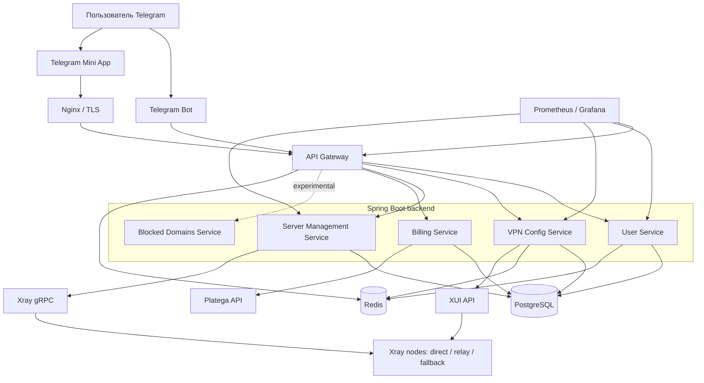

<div align="center">

# GEOVpn

**Telegram-first платформа управления подписками, устройствами и сетевым доступом на базе Xray-core**


</div>

> [!IMPORTANT]
> GEOVpn находится в активной разработке. Основные backend-сервисы, Telegram Bot и Mini App реализованы, однако репозиторий пока нельзя считать полностью готовым к развёртыванию в новой среде без настройки инфраструктуры, секретов и внешних интеграций. Android-клиент находится на стадии PoC, iOS-клиента в репозитории нет, а выборочная маршрутизация ещё требует завершения end-to-end сценария.

## Содержание

- [О проекте](#о-проекте)
- [Текущий статус](#текущий-статус)
- [Возможности](#возможности)
- [Архитектура](#архитектура)
- [Backend-модули](#backend-модули)
- [Технологии](#технологии)
- [Структура репозитория](#структура-репозитория)
- [Основные сценарии](#основные-сценарии)
- [Локальный запуск](#локальный-запуск)
- [Конфигурация](#конфигурация)
- [Тестирование](#тестирование)
- [Развёртывание и мониторинг](#развёртывание-и-мониторинг)
- [Безопасность](#безопасность)
- [Ограничения](#ограничения)
- [Roadmap](#roadmap)
- [Документация](#документация)
- [Ответственное использование](#ответственное-использование)
- [Лицензия](#лицензия)

## О проекте

GEOVpn — многомодульная платформа, в которой Telegram используется как основная точка входа для пользователя. Telegram Bot отвечает за регистрацию и быстрые действия, а Mini App предоставляет интерфейс для управления профилем, подпиской, оплатами, устройствами и конфигурациями подключения.

Серверная часть управляет полным жизненным циклом доступа:

- регистрирует пользователей через Telegram;
- хранит подписки, устройства, транзакции и подключения;
- создаёт и обновляет конфигурации для отдельных устройств;
- синхронизирует клиентов с XUI/Xray-узлами;
- выбирает подходящие серверы по состоянию, задержке, нагрузке и географии;
- формирует прямые, relay- и fallback-подключения;
- собирает технические метрики и статистику трафика;
- выполняет массовую миграцию и восстановление конфигураций.

Проект построен как набор независимых Spring Boot-сервисов с PostgreSQL, Redis, API Gateway, Docker Compose и инфраструктурными сценариями для эксплуатации нескольких сетевых узлов.

> [!NOTE]
> Файл [`docs/README.md`](docs/README.md) содержит раннюю концепцию продукта и не является актуальным источником информации о реализованных функциях. При расхождениях приоритет имеют код, миграции Flyway и этот README.

## Текущий статус

| Компонент | Статус | Что есть в репозитории |
| --- | --- | --- |
| Backend core | Реализован, развивается | Пользователи, устройства, подписки, конфигурации, серверы, трафик, биллинг и API Gateway |
| Telegram Bot | Реализован | Регистрация, проверка подписки на канал, устройства, конфигурации, оплаты, профиль и leaderboard |
| Telegram Mini App | Реализован, развивается | Профиль, тарифы, платежи, устройства, подписки, автоимпорт и управление доступом |
| VPN configuration layer | Реализован | VLESS/Reality, relay-ссылки, Hysteria2 fallback, подписки, QR-коды и синхронизация с XUI |
| Billing | Реализован, требует внешней настройки | Создание платежей, webhook и интеграция с Platega |
| Server management | Реализован | Реестр узлов, health-check, метрики, выбор сервера и сбор трафика через Xray gRPC |
| Production infrastructure | Подготовлена частично | Compose, Nginx, Certbot, Ansible, Prometheus, Grafana, health-check и rollback-скрипты |
| Admin panel | Частично реализован | В репозитории находится редактор конфигураций, но нет полного самостоятельного frontend-приложения |
| Android client | PoC | `VpnService`, Jetpack Compose и заготовка интеграции `libXray`; запуск Xray пока не подключён |
| iOS client | Не реализован | Исходного кода iOS-приложения в репозитории нет |
| Выборочная маршрутизация | Экспериментальная | Генерация routing rules существует на backend, но клиентский end-to-end сценарий не завершён |
| Автотесты | Начальный уровень | Есть отдельные тестовые ресурсы и тест security-аспекта; системное покрытие требует расширения |

## Возможности

### Пользователи и подписки

- регистрация пользователя по Telegram ID;
- проверка подписи Telegram Mini App `initData` через HMAC-SHA256;
- профиль, срок действия и тип подписки;
- промокоды, реферальный код и leaderboard;
- ограничение количества устройств и покупка дополнительных слотов;
- проверка участия пользователя в Telegram-канале;
- блокировка пользователя с сохранением причины.

### Устройства и конфигурации

- отдельная конфигурация для каждого устройства;
- генерация VLESS/Reality-подключений;
- прямые ссылки для всех активных серверов;
- relay-подключения с настраиваемым приоритетом;
- Hysteria2 как дополнительный fallback при наличии настроенного узла;
- QR-коды и Base64-подписки;
- deep links и страницы импорта для Happ, Hiddify и V2Box;
- регенерация, удаление и синхронизация конфигураций;
- массовая миграция клиентов между серверами.

### Управление серверами

- создание, изменение, выключение и удаление серверов через API;
- периодические health-check активных узлов;
- получение метрик Xray через gRPC;
- оценка серверов по задержке, нагрузке, географии, health score и поддерживаемому протоколу;
- circuit breaker и retry при обращении к Server Management Service;
- отслеживание подключений и трафика по пользователям, устройствам и серверам;
- отключение пользователя при исчерпании доступного баланса в pay-as-you-go сценарии.

### Эксплуатация

- глобальное техническое обслуживание с пересозданием и повторной синхронизацией конфигураций;
- обработка больших операций виртуальными потоками Java 21;
- ограничение конкурентных запросов к каждой XUI-панели;
- поток событий обслуживания через Server-Sent Events;
- Redis-кэш для конфигураций и метаданных;
- Spring Boot Actuator, Prometheus и Grafana;
- Nginx, TLS через Certbot, health-check, smoke-test и rollback-скрипты.

## Архитектура



### Принципы архитектуры

- **Разделение ответственности.** Управление пользователями, конфигурациями, серверами и платежами вынесено в отдельные сервисы.
- **Единая точка входа.** Внешние API-запросы проходят через API Gateway и Nginx.
- **Изоляция внутренних вызовов.** Межсервисные запросы используют отдельный internal secret и role-based проверки.
- **Отказоустойчивость.** Для критичных межсервисных вызовов применяются Resilience4j, retry и fallback.
- **Асинхронная эксплуатация.** Массовые операции выполняются параллельно с контролем нагрузки на XUI-панели.
- **Миграции вместо ручной схемы.** Структура PostgreSQL развивается через Flyway.

## Backend-модули

| Модуль | Назначение | Порт по умолчанию в инфраструктуре |
| --- | --- | ---: |
| `common` | Общие DTO, ошибки, security context, аннотации доступа, Redis и Feign-конфигурация | — |
| `api-gateway` | Маршрутизация API, CORS, проверка защищённых маршрутов и internal headers | `8080` |
| `telegram-bot` | Telegram-команды, onboarding, кнопки, подписки, устройства и взаимодействие с backend | `8081` |
| `user-service` | Пользователи, подписки, устройства, соединения, referrals, promo и admin API | `8082` |
| `vpn-config-service` | Генерация и хранение конфигураций, подписки, QR, XUI, relay, Hysteria2 и maintenance | `8083` |
| `server-management-service` | Серверы, health-check, traffic accounting, Xray gRPC и cluster health | `8084` |
| `billing-service` | Транзакции, платежные ссылки, webhook и статистика выручки | `8085` |
| `blocked-domains-service` | Каркас отдельного сервиса доменных правил; основная текущая логика находится в `vpn-config-service` | `8085` в текущем конфиге |

> [!WARNING]
> `billing-service` и `blocked-domains-service` используют пересекающееся значение порта в части текущих конфигураций. Перед совместным запуском назначьте им разные порты.

## Технологии

### Backend

- Java 21;
- Spring Boot 3.2.1;
- Spring Cloud 2023.0.0;
- Spring Data JPA и Hibernate;
- Spring Cloud Gateway и OpenFeign;
- Resilience4j;
- PostgreSQL 15 и Flyway;
- Redis 7;
- gRPC и Protocol Buffers;
- Quartz и Spring Scheduling;
- ZXing для QR-кодов;
- Maven multi-module build.

### Frontend

- React 18;
- TypeScript 5;
- Vite 5;
- Zustand;
- Axios;
- Framer Motion;
- Tailwind CSS;
- Telegram Web App API.

### Сетевая и эксплуатационная часть

- Xray-core;
- VLESS + Reality;
- Hysteria2;
- XUI API;
- Docker и Docker Compose;
- Nginx и Certbot;
- Ansible;
- Prometheus и Grafana;
- shell-скрипты для deploy, health-check, smoke-test и rollback.

## Структура репозитория

```text
GEOVpn/
├── backend/
│   ├── api-gateway/
│   ├── billing-service/
│   ├── blocked-domains-service/
│   ├── common/
│   ├── server-management-service/
│   ├── telegram-bot/
│   ├── user-service/
│   └── vpn-config-service/
├── mini-app/                  # Telegram Mini App: React + TypeScript
├── admin-panel/               # Частично реализованный frontend администрирования
├── mobile/android/            # Android PoC на Kotlin/Compose
├── infrastructure/
│   ├── ansible/
│   ├── ci-cd/
│   ├── docker/
│   ├── monitoring/
│   └── nginx/
├── nginx/                     # Reverse proxy и TLS-конфигурация
├── xray/                      # Базовая конфигурация Xray
├── docs/                      # Технические и исторические материалы
├── docker-compose.yml         # Основной состав контейнеров
├── mvnw / mvnw.cmd            # Maven Wrapper
└── README.md
```

## Основные сценарии

### 1. Регистрация пользователя

1. Пользователь запускает Telegram Bot или Mini App.
2. Backend проверяет Telegram `initData` и регистрирует пользователя.
3. При наличии start parameter применяется реферальный сценарий.
4. Пользователь получает профиль, сведения о подписке и доступных устройствах.

### 2. Создание конфигурации

1. Пользователь добавляет устройство.
2. `vpn-config-service` проверяет подписку и доступный лимит устройств.
3. Сервис получает список активных узлов и рассчитывает их рейтинг.
4. Создаются UUID и набор прямых, relay- и fallback-ссылок.
5. Клиент регистрируется на XUI/Xray-узлах.
6. Пользователь получает subscription URL, QR-код или ссылку автоимпорта.

### 3. Мониторинг и учёт трафика

1. `server-management-service` периодически проверяет доступность узлов.
2. Xray gRPC предоставляет статистику по пользователям.
3. Сервис рассчитывает дельту трафика и сохраняет агрегированные данные.
4. В pay-as-you-go сценарии стоимость может списываться с баланса пользователя.

### 4. Миграция и техническое обслуживание

1. Администратор запускает перенос клиентов или глобальное обслуживание.
2. Операция выполняется пакетно и не останавливается из-за единичной ошибки.
3. Конкурентность запросов ограничивается отдельно для каждой XUI-панели.
4. Прогресс отправляется интерфейсу через SSE.
5. Конфигурации и Redis-кэш синхронизируются повторно.

## Локальный запуск

### Требования

- JDK 21;
- Docker Engine и Docker Compose;
- Node.js 20+ и npm;
- Git;
- свободные порты `3000`, `5432`, `6379`, `8080–8085`;
- Telegram Bot token для реального Telegram-сценария;
- доступ к XUI/Xray-узлам для end-to-end генерации конфигураций;
- реквизиты Platega для проверки реальных платежей.

### 1. Клонирование

```bash
git clone https://github.com/LUFFPUFF/GEOVpn.git
cd GEOVpn
```

### 2. PostgreSQL и Redis для локальной разработки

```bash
docker compose -f backend/docker-compose-local.yml up -d
```

### 3. Проверка backend

Linux/macOS:

```bash
./mvnw -f backend/pom.xml clean verify
```

Windows:

```powershell
mvnw.cmd -f backend\pom.xml clean verify
```

### 4. Telegram Mini App

```bash
cd mini-app
npm ci
npm run dev
```

Vite запускает frontend на `http://localhost:3000` и проксирует API-запросы к локальным backend-сервисам.

### 5. Полный Docker Compose

После подготовки `.env`, внешних endpoint и секретов:

```bash
docker compose --env-file .env up --build -d
```

> [!CAUTION]
> Полный Compose пока не является гарантированным one-command deployment для новой среды. Перед запуском необходимо настроить `.env`, проверить Docker build contexts, назначить уникальные порты и либо дополнить `admin-panel`, либо исключить его из запуска.

## Конфигурация

Проект использует environment variables. Значения секретов не должны храниться в Git.

| Группа | Основные переменные |
| --- | --- |
| PostgreSQL | `POSTGRES_DB`, `POSTGRES_USER`, `POSTGRES_PASSWORD`, `DB_HOST`, `DB_PORT` |
| Redis | `REDIS_HOST`, `REDIS_PORT`, `REDIS_PASSWORD` |
| Сервисы | `GATEWAY_PORT`, `USER_SERVICE_PORT`, `VPN_CONFIG_PORT`, `SERVER_MGM_PORT`, `BILLING_PORT`, `BOT_PORT` |
| Внутренняя безопасность | `INTERNAL_SECRET`, `JWT_SECRET`, `ADMIN_TOKEN`, `ADMIN_USER_IDS` |
| Telegram | `TELEGRAM_BOT_TOKEN`, `TELEGRAM_BOT_USERNAME`, `TELEGRAM_CHANNEL_ID`, `TELEGRAM_CHANNEL_URL` |
| Платежи | `PLATEGA_MERCHANT_ID`, `PLATEGA_SECRET_KEY`, `PLATEGA_RETURN_URL` |
| XUI/Xray | `VPN_MAIN_PANEL_URL`, `VPN_MAIN_PANEL_USER`, `VPN_MAIN_PANEL_PASS`, inbound IDs и relay-параметры |
| Hysteria2 | `HY2_PORT`, `HY2_PASS`, `HY2_SNI` |
| Межсервисные адреса | `USER_SERVICE_URL`, `VPN_CONFIG_SERVICE_URL`, `SERVER_MGM_SERVICE_URL`, `BILLING_SERVICE_URL` |

Рекомендуемый порядок подготовки окружения:

1. создать локальный `.env` вне системы контроля версий;
2. сгенерировать уникальные `JWT_SECRET` и `INTERNAL_SECRET`;
3. указать отдельные credentials для PostgreSQL и Redis;
4. подключить Telegram, Platega и XUI только после запуска базовых сервисов;
5. проверить конфигурацию командой `docker compose config`;
6. выполнить health-check сервисов до подключения пользователей.

## Тестирование

Backend:

```bash
./mvnw -f backend/pom.xml clean verify
```

Mini App:

```bash
cd mini-app
npm ci
npm run build
```

Инфраструктурные проверки:

```bash
bash infrastructure/ci-cd/scripts/health-check.sh
bash infrastructure/ci-cd/scripts/smoke-tests.sh
```

Текущее автоматизированное покрытие ограничено. Перед production-релизом необходимы дополнительные unit-, integration- и end-to-end тесты для:

- генерации и миграции конфигураций;
- платежных webhook;
- Telegram authentication;
- лимитов устройств и подписок;
- отказов XUI/Xray-узлов;
- глобального maintenance;
- Mini App и Android-клиента.

## Развёртывание и мониторинг

В репозитории находятся:

- `infrastructure/docker/docker-compose.prod.yml` — production-oriented Compose;
- `infrastructure/ansible/deploy-vpn.yml` — Ansible-сценарий развёртывания узлов;
- `infrastructure/nginx/` — reverse proxy и TLS;
- `infrastructure/monitoring/prometheus/` — конфигурация Prometheus;
- `infrastructure/ci-cd/scripts/` — deploy, health-check, smoke-test и rollback;
- `backend/vpn-config-service/src/main/resources/sh/` — установка и обновление сетевых компонентов.

Основные health endpoints:

```text
/actuator/health
/api/v1/servers/infrastructure/health
```

Production-файлы содержат environment-specific параметры и должны быть адаптированы под собственные домены, inventory, серверы, TLS-сертификаты и secret storage.

## Безопасность

В проекте реализованы:

- HMAC-SHA256 проверка Telegram Mini App `initData`;
- security context с ролями `USER`, `ADMIN` и `SERVICE`;
- internal secret для межсервисных запросов;
- отдельный admin token;
- защищённые административные endpoint;
- журналирование блокировок и причин ограничения доступа;
- валидация webhook платежного провайдера;
- Nginx/TLS-контур для внешнего трафика.

Перед публичным или production-развёртыванием обязательно:

1. удалить секреты и инфраструктурные credentials из отслеживаемых файлов и истории Git;
2. перевыпустить все значения, которые когда-либо попадали в публичный репозиторий;
3. хранить секреты в CI/CD secret storage или специализированном secret manager;
4. ограничить доступ к PostgreSQL, Redis, Actuator, Grafana и XUI по сети;
5. настроить rate limiting на API Gateway — текущий `KeyResolver` сам по себе не включает фильтр ограничения запросов;
6. проверить CORS, Telegram origin, webhook signature и trusted proxy headers;
7. отключить development fallback и тестовые Telegram ID в production-сборке;
8. провести dependency, container и secret scanning.

> [!WARNING]
> Текущий snapshot репозитория требует отдельного secret-hygiene аудита перед дальнейшей публичной эксплуатацией. Не используйте существующие примерные или environment-specific значения как production credentials.

## Ограничения

- Android-модуль создаёт VPN-интерфейс, но вызовы `libXray` пока оставлены как заготовка.
- iOS-клиент отсутствует.
- `admin-panel` не содержит полного набора файлов для самостоятельной сборки.
- `blocked-domains-service` пока является каркасом; часть логики находится в `vpn-config-service`.
- routing rules содержат статические списки и `TODO` для автоматического обновления.
- готового `.env.example` в репозитории нет.
- полного API reference/OpenAPI-документа пока нет.
- CI/CD-скрипты присутствуют, но готовый workflow в `.github/workflows` отсутствует.
- автоматизированное тестовое покрытие недостаточно для уверенного production-релиза.
- часть инфраструктурных файлов привязана к конкретному окружению и требует параметризации.

## Roadmap

- [ ] удалить credentials и environment-specific данные из Git, добавить безопасный `.env.example`;
- [ ] завершить и выделить полноценный admin panel;
- [ ] подключить `libXray` в Android-клиенте и добавить lifecycle/error handling;
- [ ] реализовать автоматическое обновление доменных правил и завершить selective routing;
- [ ] устранить конфликты портов и унифицировать Compose-файлы;
- [ ] расширить unit-, integration- и end-to-end тесты;
- [ ] добавить GitHub Actions для backend, frontend, контейнеров и security scanning;
- [ ] добавить OpenAPI/Swagger и отдельный runbook для эксплуатации;
- [ ] подготовить versioned releases, changelog и migration guide;
- [ ] провести нагрузочное и отказоустойчивое тестирование.

## Документация

- [Техническое описание проекта](docs/technical_docmentation_telegram_vpn.md)
- [Планирование Phase 3](docs/PHASE3_BREAKDOWN.md)
- [Материалы по мобильным приложениям и Smart Mode](docs/mobile_apps_smart_mode.md)
- [Ansible deployment](infrastructure/ansible/deploy-vpn.yml)
- [Production Compose](infrastructure/docker/docker-compose.prod.yml)

Часть документов отражает ранние планы и может не совпадать с текущим кодом. Перед изменениями сверяйтесь с реализацией и миграциями Flyway.

## Ответственное использование

Оператор развёрнутого сервиса самостоятельно отвечает за соблюдение законодательства, правил хостинг-провайдеров, Telegram, платежных систем и требований к обработке персональных и платёжных данных. Используйте проект только в законных целях и в пределах разрешённой инфраструктуры.

## Лицензия

В репозитории не опубликован файл лицензии. Исходный код доступен для ознакомления; копирование, распространение и коммерческое использование требуют отдельного разрешения правообладателя.

Для вопросов по проекту используйте профиль [LUFFPUFF](https://github.com/LUFFPUFF) или GitHub Issues.
